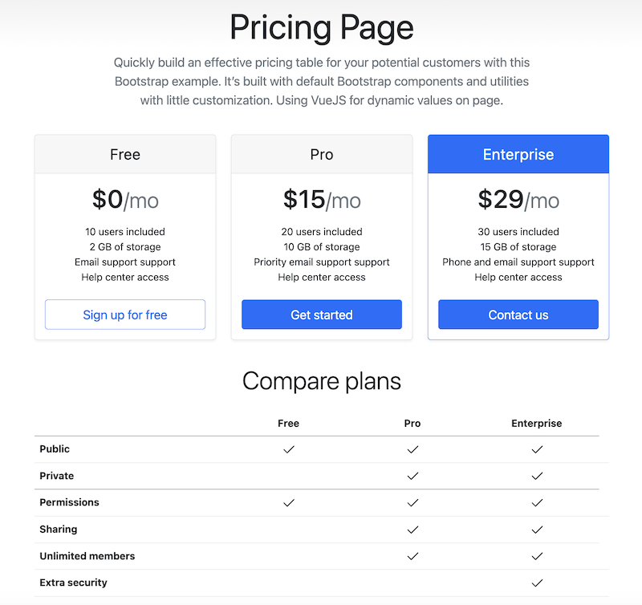

## GCN Micronaut "Price" page SPA with ATP - powered by Graal Cloud Native

GraalVM Cloud Native (GCN) Micronaut sample project with REST API and single page web app and AutonomousDB.

The intention of this sample project is to demonstrate the VS Code GCN extensions & tooling. The database classes and interfaces were generated
with the GCN extension from the database schema that is a very handy tool for developers.

#### Instructions

1. Create a sample ATP database instance with schema and data and public access https://github.com/mikarinneoracle/atp-ords-liquibase-demo (Choose the part #2 to use Resource Manager/Terraform).
2. Create the VS Code project by cloning this repo locally. After cloning remove the git directory from project root by <code>rm -rf .git</code> in the project terminal.
3. Edit <a href="https://github.com/mikarinneoracle/gcn-micronaut-atp-price-spa/blob/master/oci/src/main/resources/application-dev.yml#L12"><code>application-dev.yaml line 12</code></a> by placing the OCID of the ATP instance created in the first step.
4. Edit <a href="https://github.com/mikarinneoracle/gcn-micronaut-atp-price-spa/blob/master/oci/src/main/resources/application-oraclecloud.yml#L12"><code>application-oraclecloud.yaml line 12</code></a> by placing the OCID of the ATP instance created in the first step.
5. Build and run the app locally in VS Code by navigating to <code>Application.java</code> under <i>oci/src/main/java/com/example/</i> directory and clicking the Run Java button ( &#9655; ).
 This will work locally since I'm configuring the environment <code>dev</code> by default in
<a href="https://github.com/mikarinneoracle/gcn-micronaut-atp-price-spa/blob/master/oci/src/main/java/com/example/Application.java#L31"><code>Application.java line 31</code></a> (in the GCN generated project the default environment is <code>oraclecloud</code>).
6. Create DevOps project from VS Code and build and deploy the JVM container to OKE using the extension tooling.
 <b><i>Tip</i></b>: I've modified the GCN generated <code>build pipeline</code> a bit so that I've added a new step to end of it to trigger the OKE <code>deployment pipeline</code> automatically after the build. Also, for automatic builds when committing code I've added a trigger to OCI DevOps project to kick-off the deployment pipeline (and hence also the deployment pipeline) automatically. This works for both JVM and GraalVM Native builds. 
7. Create OCI load balancer with <code>kubectl</code> to access the the application from browser:
<pre>
kubectl apply -f - &lt;&lt;EOF
apiVersion: v1
kind: Service
metadata:
  name: gcn-micronaut-atp-price-spa-lb
spec:
  selector:
    app:  gcn-micronaut-atp-price-spa
  ports:
    - protocol: TCP
      port: 80
      targetPort: 8080
  type: LoadBalancer
EOF
</pre>
8. Access the OCI load balancer url from browser e.g.
<pre>
kubectl get svc
NAME                         TYPE           CLUSTER-IP      EXTERNAL-IP       PORT(S)             AGE
gcn-micronaut-atp-price-lb   LoadBalancer   10.96.100.164   <b>138.2.167.156</b>     80:30258/TCP        8s
</pre>

 

## Micronaut 4.0.3 Documentation

- [User Guide](https://docs.micronaut.io/4.0.3/guide/)
- [API Reference](https://docs.micronaut.io/4.0.3/api/)
- [Configuration Reference](https://docs.micronaut.io/4.0.3/guide/configurationreference.html)
- [Micronaut Guides](https://guides.micronaut.io/)
---
- [GraalVM Gradle Plugin documentation](https://graalvm.github.io/native-build-tools/latest/gradle-plugin.html)
- [Micronaut Gradle Plugin documentation](https://micronaut-projects.github.io/micronaut-gradle-plugin/latest/)
- [Shadow Gradle Plugin](https://plugins.gradle.org/plugin/com.github.johnrengelman.shadow)
## Feature data-jdbc documentation

- [Micronaut Data JDBC documentation](https://micronaut-projects.github.io/micronaut-data/latest/guide/index.html#jdbc)

## Feature flyway documentation

- [Micronaut Flyway Database Migration documentation](https://micronaut-projects.github.io/micronaut-flyway/latest/guide/index.html)

- [https://flywaydb.org/](https://flywaydb.org/)

## Feature http-client documentation

- [Micronaut HTTP Client documentation](https://docs.micronaut.io/latest/guide/index.html#nettyHttpClient)

## Feature jdbc-hikari documentation

- [Micronaut Hikari JDBC Connection Pool documentation](https://micronaut-projects.github.io/micronaut-sql/latest/guide/index.html#jdbc)

## Feature oracle-cloud-atp documentation

- [Micronaut Oracle Cloud Autonomous Transaction Processing (ATP) documentation](https://micronaut-projects.github.io/micronaut-oracle-cloud/latest/guide/#_micronaut_oraclecloud_atp)

- [https://www.oracle.com/autonomous-database/autonomous-transaction-processing/](https://www.oracle.com/autonomous-database/autonomous-transaction-processing/)

## Feature oracle-cloud-sdk documentation

- [Micronaut Oracle Cloud SDK documentation](https://micronaut-projects.github.io/micronaut-oracle-cloud/latest/guide/)

- [https://docs.cloud.oracle.com/en-us/iaas/Content/API/SDKDocs/javasdk.htm](https://docs.cloud.oracle.com/en-us/iaas/Content/API/SDKDocs/javasdk.htm)

## Feature serialization-jackson documentation

- [Micronaut Serialization Jackson Core documentation](https://micronaut-projects.github.io/micronaut-serialization/latest/guide/)

## Feature test-resources documentation

- [Micronaut Test Resources documentation](https://micronaut-projects.github.io/micronaut-test-resources/latest/guide/)

## Feature validation documentation

- [Micronaut Validation documentation](https://micronaut-projects.github.io/micronaut-validation/latest/guide/)

